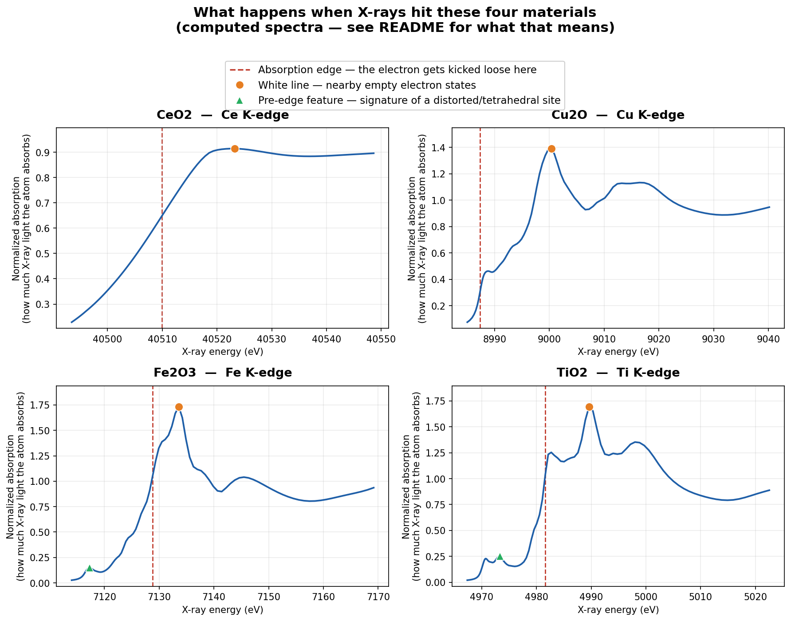
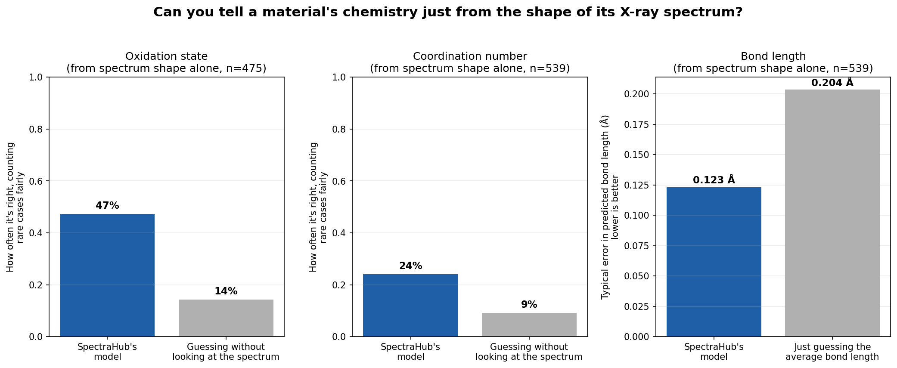
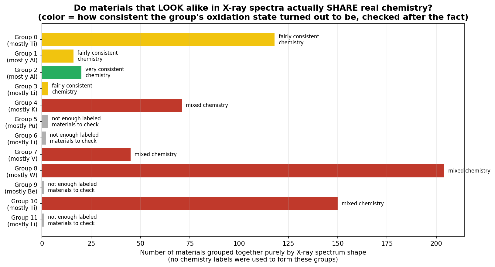

# SpectraHub

A small end-to-end pipeline that pulls computed X-ray absorption spectra (XAS) for metal oxides from the [Materials Project](https://materialsproject.org), turns them into a queryable database, engineers features from the raw spectra, and uses those features to cluster materials by spectral "fingerprint" and predict oxidation state, coordination number, and bond length directly from the shape of a spectrum.

Everything below reflects the actual, currently-verified state of the data as of this write-up: **2004 spectra**, **888 unique materials**, **737 with structural labels**.

## What this is (and isn't)

Every spectrum here is **ab initio computed** (FEFF real-space Green's-function multiple-scattering theory), not experimentally measured. Materials Project tags every record `source_type = "computed-database"`, and this project preserves that tag end to end — nothing here should be read as lab-measured data.

Four materials are hand-picked and flagged `is_highlighted = True` because they're the ones this project cares most about: **Cu2O, Fe2O3, TiO2, CeO2**. Everything else (884 more materials) comes from an open-ended scan of every metal-oxide combination Materials Project has FEFF K-edge data for.

**Known data caveat:** CeO2's computed XAS onset sits ~50 eV above the tabulated experimental Ce K-edge — larger than FEFF's documented typical referencing error. This is consistent across independent XANES/XAFS/EXAFS calculations for the same material, so it's treated as a genuine feature of that database entry, not a fetch bug — but no verified mechanism has been established, and no correction is applied.

## Results, in plain terms

*Everything in this section is written for a chemical/materials engineer, not
a data scientist — no ML terminology required. If you want the underlying
methodology and metrics, that's in "Under the hood" further down.*

Generate these yourself any time with `python src/reports.py` (reads only —
run stages 1-6 first if you haven't).

### 1. What actually happens when X-rays hit these materials



Each curve is a computed X-ray absorption spectrum: as X-ray energy increases
(x-axis), you hit the energy where the material starts absorbing sharply (the
**absorption edge** — an electron gets ejected from the absorbing atom). Two
features right after that edge carry most of the useful chemistry:

- **Chemical engineering takeaways:**
- The **edge position** shifts with oxidation state (more oxidized = higher
  edge energy, the "chemical shift"). In practice, this means a quick XANES
  scan can serve as a fast, non-destructive readout of a catalyst's oxidation
  state during a reaction — no need to remove the sample from a reactor to
  check its redox state.
- **White-line intensity** tracks how many empty d-orbitals the absorbing
  atom has. A strong white line (Ti, sharp peak) versus a weak/absent one
  (Cu, d10 — no empty d-states) is a quick way to pre-screen candidate
  catalyst/support materials for redox activity before committing to DFT or
  beamtime.
- A **pre-edge feature** (seen here for Fe2O3 and TiO2) signals that the
  absorbing atom sits in a distorted, often tetrahedral site rather than a
  symmetric octahedral one. This is a practical way to flag unusual active
  sites in a mixed-oxide catalyst without a full structure refinement.

### 2. Can you read a material's chemistry off the shape of its spectrum alone?



Blue bars are SpectraHub's model; gray bars are what you'd get by guessing
without looking at the spectrum at all. Higher blue bars (left two panels)
and lower blue bars (right panel, since it's an error) both mean the model
is doing real work, not just getting lucky.

- **Chemical engineering takeaways:**
- Oxidation state is genuinely readable from spectral shape alone (about
  3.4x better than an uninformed guess) — useful as a cheap pre-screen to
  flag "this material's redox state looks unusual" across a large computed
  or experimental spectral library, before spending time on a full analysis.
- Coordination number is harder to read from near-edge shape alone (still
  better than guessing, but modestly). If coordination geometry is what you
  actually care about, pair this near-edge (XANES) data with the
  longer-range EXAFS data this project also fetches — near-edge shape alone
  under-determines geometry.
- Bond length predictions cut typical error by about 40% versus a naive
  guess — a reasonable first-pass structural sanity check on a new or
  computed material, not a replacement for a proper structure refinement.

### 3. Do materials that "look" alike in their spectra actually share chemistry?



The computer grouped materials purely by spectrum shape — it was never told
any material's oxidation state while forming these groups. This chart checks,
after the fact, whether those shape-based groups turned out to share real
chemistry (green/yellow = yes, consistently; red = no, a mixed-bag group).

- **Chemical engineering takeaways:**
- Some groups (notably the mostly-Al2O3 group) are chemically pure — every
  member shares the same oxidation state. That means shape-based grouping
  can be trusted, at least for some material families, to pre-sort a large
  spectral library (including ones you digitize from literature yourself)
  into chemically coherent buckets before deeper analysis.
- Other groups are chemically mixed. The practical lesson: "these two
  spectra look similar" is a useful first filter, not proof of identical
  chemistry — always confirm with a structural or compositional label
  before treating visually-similar spectra as chemically equivalent.

### The full data table

[`results/materials_table.csv`](results/materials_table.csv) — one row per
material, plain column headers (Material, Oxidation state, Coordination
number, Average bond length, Spectral shape group, Data source), no code
required to read it. Open it directly in Excel/Sheets.

## The pipeline

Eight stages, each a standalone script, each writing to (or reading from) one shared SQLite database (`data/spectrahub.db`):

| # | Script | What it does | Needs MP_API_KEY? |
|---|---|---|---|
| 1 | `src/mp_xas_fetch.py` | Fetches XANES/XAFS/EXAFS spectra from Materials Project, writes JSON + CSV + summary plot | Yes |
| 2 | `src/ingest.py` | Loads the fetched JSON records into `spectrahub.db` | No |
| 3 | `src/label_fetch.py` | Fetches oxidation state, coordination number, and bond length per material from Materials Project's structure data | Yes |
| 4 | `src/feature_engineering.py` | Computes edge energy, edge jump, white-line, and pre-edge features from each raw spectrum | No |
| 5 | `src/clustering_similarity.py` | Clusters XANES spectra by shape and powers "find a similar fingerprint" search | No |
| 6 | `src/ml_models.py` | Predicts oxidation state / coordination number / bond length from spectral features, with honest leave-one-out evaluation | No |
| 7 | `src/api.py` | Read-only FastAPI layer serving all of the above | No |
| 8 | `src/reports.py` | Turns stages 1-6's output into the plain-English figures and table in "Results, in plain terms" above | No |

Only steps 1 and 3 talk to Materials Project's live API — everything else runs offline against the local database.

## Quick start

```bash
pip install -r requirements.txt
$env:MP_API_KEY="your_key_here"          # PowerShell; use export on macOS/Linux

cd src
python mp_xas_fetch.py --mode all         # ~25-30 min: fetches all 888 materials
python ingest.py                          # seconds: loads JSON into spectrahub.db
python label_fetch.py                     # several minutes: one MP API call per material
python feature_engineering.py             # seconds: pure numpy, no network
python clustering_similarity.py --cluster --k 12
python ml_models.py                       # seconds: trains + evaluates
python reports.py                         # seconds: writes the plain-English figures/table
uvicorn api:app --reload                  # starts the API at http://127.0.0.1:8000/docs
```

`python mp_xas_fetch.py` with no `--mode` flag fetches just the 4 highlighted materials in seconds, useful for a quick smoke test before committing to the full ~30-minute run.

## Under the hood (methodology and metrics, for a technical audience)

*This is the same results shown in plain terms above, restated with the
actual methodology and metrics for anyone evaluating this project
technically.*

**Coverage** (how much of the data actually has usable values — not padded):

- Structural labels: 737/888 materials (83%) got a coordination number, 651/888 (73%) got an oxidation state.
- Spectral features: white-line features computed for 100% of spectra (2004/2004); pre-edge features only for 466/2004 (23%) — because many fetched XANES windows start too close to the edge to have pre-edge data at all, not because of a bug (documented and measured directly in `feature_engineering.py`).

**Does spectral shape encode chemistry?** Tested with leave-one-out cross-validation against a naive baseline, on 539 XANES materials:

| Target | Raw accuracy / error | Naive baseline | Macro recall (fair across classes) | Verdict |
|---|---|---|---|---|
| Oxidation state (7 classes) | 59.2% | 36.2% (majority-class) | 0.473 vs. 0.143 random-guess | Real signal — matches the known "chemical shift" effect in XAS |
| Coordination number (11 classes) | 49.2% | 50.3% (majority-class) | 0.241 vs. 0.091 random-guess | Real but modest signal, once measured correctly (see below) |
| Bond length (regression) | MAE 0.123 Å | MAE 0.204 Å (mean baseline) | — | Real signal — ~40% error reduction |

**A real bug was caught and fixed during this project, worth recording rather than hiding:** the first version of `ml_models.py` selected its k-NN neighborhood size (`k`) by raw LOOCV accuracy. For coordination_number, where one class (CN=6) makes up 50.3% of the data, that criterion picked `k=21` — a model that predicted CN=6 for 83% of materials and never predicted 6 of the 11 real coordination numbers at all. Raw accuracy (53.4%) looked like a modest win over the 50.3% baseline, but it was really just exploiting class imbalance, not learning spectral shape. Selecting `k` by **macro recall** instead (each class weighted equally, so collapsing to the majority class is heavily penalized) picks `k=1`, which uses all 11 classes and scores 2.65x above a random-guess baseline — a smaller, honester, more defensible result than the original number. `ml_models.py` now selects classification k by macro recall for exactly this reason, and reports both metrics so this trade-off is visible, not hidden.

Coordination number remaining the weaker of the two classification targets (even correctly measured) makes physical sense: it's a geometric property that near-edge XANES shape encodes less directly than electronic oxidation state does.

**Does the unsupervised clustering find real chemistry, with zero labels involved in the clustering itself?** Cluster 2 (20 materials, mostly Al2O3, found purely from spectral shape) has an oxidation-state standard deviation of **0.0** — every single member shares the same oxidation state — against a dataset-wide baseline of 1.16. Not every cluster is this clean, and that's stated honestly in the script's own output, not smoothed over.

**Chemistry sanity checks that passed:** pre-edge intensity across the four highlighted materials follows exactly the ordering XAS theory predicts by d-electron count — none for Cu2O (d¹⁰, no empty d-states), weak for Fe2O3 (d⁵, dipole-forbidden in its octahedral site), strong for TiO2 (d⁰, the textbook case for a resolved pre-edge). Cu2O's computed bond length (1.839 Å) and coordination number (2) match the Materials Project website's own description of mp-361 exactly.

## API

```bash
cd src && uvicorn api:app --reload
```

Then visit `http://127.0.0.1:8000/docs` for interactive documentation, or:

```
GET /stats                                          overview counts
GET /materials?formula_contains=Cu2O                 search materials
GET /materials/{mp_id}                               full detail for one material
GET /spectra/{record_id}                              raw spectrum + computed features
GET /spectra/{record_id}/similar?top=10                nearest XANES fingerprints
GET /clusters/{cluster_id}                            all members of a cluster
GET /predictions?task=oxidation_state&mismatches_only=true   audit model errors directly
```

The API is read-only by design — it serves what the pipeline scripts already computed, and never re-runs a model or triggers a live Materials Project fetch on your behalf.

### Running it on your LAN (accessible from your phone / other devices at home)

No cloud hosting needed for this — the API and the pipeline scripts run on the same machine either way, so serving it to other devices on your own network is just a matter of binding to your network interface instead of `localhost`:

```bash
cd src
uvicorn api:app --host 0.0.0.0 --port 8000
```

Then, on the same machine, find your LAN IP:

```powershell
ipconfig    # look for "IPv4 Address" under your active network adapter, e.g. 192.168.1.42
```

From any other device on the same WiFi/network, visit `http://192.168.1.42:8000/docs` (using your actual IP).

- **Windows Firewall** will likely prompt the first time you run this — allow access for **Private networks only**, not Public. That keeps it reachable on your home network but not exposed if you're ever on a public/untrusted WiFi.
- **The DB updates live automatically.** Since `spectrahub.db` uses WAL mode (`db.py`), you can rerun `label_fetch.py`, `feature_engineering.py`, etc. while the API is running and serving requests — no restart needed, no lock contention between the long-running API process and a script writing to the same file.
- This only runs while your machine is on and the command is running — there's no background/always-on service by default. If you want it to persist across reboots or terminal closes, that's a further step (e.g. Windows Task Scheduler or running it as a service) — not set up here since it wasn't asked for.

## Project structure

```
src/
  mp_xas_fetch.py          # stage 1: fetch spectra from Materials Project
  ingest.py                 # stage 2: load JSON into SQLite
  label_fetch.py             # stage 3: fetch structural labels
  feature_engineering.py      # stage 4: derive spectral features
  clustering_similarity.py     # stage 5: cluster + similarity search
  ml_models.py                  # stage 6: supervised prediction models
  api.py                          # stage 7: FastAPI layer
  reports.py                       # stage 8: plain-English figures + table
  db.py                             # shared SQLAlchemy schema
  schema.py                          # JSON record schema + validator
  diagnose_mp_api.py                  # one-off MP API diagnostic (kept for reference)
data/
  xanes/                    # per-record JSON + MANIFEST.json + summary.csv
  spectrahub.db              # SQLite database (all 7 tables)
results/
  xas_summary.png            # overlay plot of the 4 highlighted materials
  materials_table.csv         # plain-column table, one row per material
  figures/
    highlighted_spectra_annotated.png   # Figure 1: annotated flagship spectra
    model_performance_plain.png          # Figure 2: model quality, plain language
    cluster_chemistry_check.png           # Figure 3: does shape-grouping = real chemistry
```

## Design choices worth knowing about

- **No scikit-learn or scipy.** Both were unreliable to install in this project's development environment, so clustering (k-means), similarity search (cosine similarity), and prediction (k-nearest-neighbors) are all hand-implemented in pure numpy — verified directly against real data rather than assumed correct. If scikit-learn installs cleanly for you, swapping in a Random Forest for `ml_models.py` would likely improve on the k-NN results above.
- **SQLite, not Postgres.** Fine at this scale (~2000 records); the schema uses plain SQLAlchemy ORM with no SQLite-specific types, so switching the engine URL later doesn't require a rewrite.
- **Materials Project's identifier scheme changed recently** (database version `2026-04-13`): IDs are transitioning from numeric (`mp-149`) to base-26 `AlphaID`s (`mp-hilze`). This project's `mp_id` values are the AlphaID `task_id` from the XAS API route — confirmed live to resolve correctly against Materials Project's other API routes, with or without the `mp-` prefix.

## Requirements

```
mp-api>=0.41
pymatgen>=2024.1.1
matplotlib>=3.7
sqlalchemy>=2.0
numpy>=1.24
fastapi>=0.110
uvicorn[standard]>=0.29
```

A free Materials Project API key is required for stages 1 and 3: [next-gen.materialsproject.org/api](https://next-gen.materialsproject.org/api).
